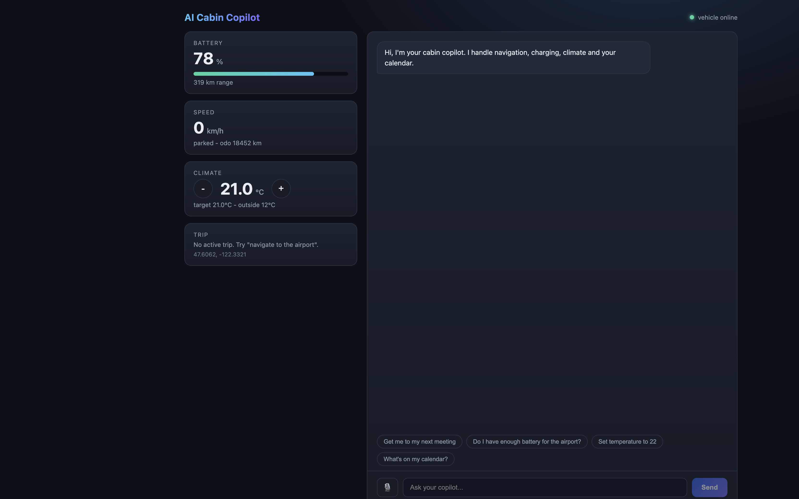

# AI Cabin Copilot

[](https://github.com/vigp17/Automotive_AI_Agent/actions/workflows/ci.yml)
[](https://www.python.org/)
[](https://langchain-ai.github.io/langgraph/)
[](https://fastapi.tiangolo.com/)
[](https://react.dev/)

A **voice-enabled, multi-agent in-cabin assistant** for software-defined vehicles. A LangGraph orchestrator routes driver requests to Navigation, EV Charging, HVAC, and Calendar agents operating over live vehicle signals — with a React cabin dashboard and a clean path to production HMI integration.

> **Demo:** run locally in under 2 minutes (no Azure keys required). See [Quickstart](#quickstart) and the [2-min demo script](docs/portfolio-demo-script.md).



---

## Highlights (for recruiters & interviews)

| What I built | Detail |
|---|---|
| **Multi-agent orchestration** | LangGraph supervisor classifies intent and routes to 4 domain agents + a cross-agent trip planner |
| **Cross-agent workflow** | "Get me to my next meeting" → calendar → route/ETA → EV charging check → navigation start |
| **Vehicle signal layer** | Stateful simulator (SOC, speed, GPS, HVAC) behind a `VehicleBus` interface for future CAN/Ethernet |
| **Voice pipeline** | Browser Web Speech API + local Whisper STT fallback — works without cloud keys |
| **Production-ready seams** | Azure OpenAI, Speech, and Maps clients behind mock/real switches; Docker Compose deployment |
| **Test coverage** | 20 pytest tests covering simulator physics, API endpoints, orchestration, and trip planning |

**Tech stack:** Python · FastAPI · LangGraph · LangChain · Azure OpenAI · Azure Speech · Azure Maps · React · TypeScript · Vite · Docker · SQLite

---

## Features

- **Voice assistant** — speech in/out via Web Speech API, local Whisper, or Azure Speech (`/voice`)
- **Navigation agent** — routing, ETA, and traffic via Azure Maps (mock geocoder offline)
- **EV charging planner** — SOC analysis and charging-stop recommendations from a station dataset
- **Calendar integration** — JSON-backed schedule with meeting-aware trip planning
- **Vehicle simulator** — live drive loop: battery drain, motion along routes, climate control
- **HVAC agent** — cabin comfort via `set_temperature` and natural-language commands
- **Driver wellness** — rule-based nudges (long drives, low battery, late-night fatigue)
- **Trip reports** — markdown report endpoint (`/report`)
- **Conversation memory** — per-session SQLite checkpointer (LangGraph)

---

## Quickstart

Everything runs in **mock mode** by default — no Azure keys needed.

```bash
# Backend
python3 -m venv .venv
.venv/bin/pip install -r backend/requirements.txt
cd backend && ../.venv/bin/python -m uvicorn app.main:app --port 8000

# Frontend (second terminal)
cd frontend && npm install && npm run dev
# → http://localhost:5173
```

**Try these in the chat:**

| Prompt | Agent / workflow |
|---|---|
| "Get me to my next meeting" | Trip planner (calendar + nav + EV) |
| "Do I have enough battery for the airport?" | EV agent |
| "Set temperature to 22" | HVAC agent |
| "What's on my calendar?" | Calendar agent |

### Docker

```bash
docker compose up --build
# frontend → http://localhost:3000  |  backend → http://localhost:8000
```

### Tests

```bash
cd backend && ../.venv/bin/python -m pytest
```

---

## Architecture

```
Driver (voice/text)
  → STT (browser / Whisper / Azure)
  → FastAPI (/chat, /voice)
  → LangGraph orchestrator
       → Navigation · EV · HVAC · Calendar agents
       → Trip planner (cross-agent workflow)
       → Wellness rules
  → VehicleBus → simulator (future: CAN / VSS / SOME-IP)
  → SQLite conversation memory
  → TTS → Driver
  ↔ React cabin dashboard (WebSocket live state)
```

The simulator sits behind a **`VehicleBus` abstraction** (`backend/simulator/bus.py`) so a real CAN or automotive-Ethernet adapter can replace it on production hardware without touching agents or tools.

Full details: [`docs/architecture.md`](docs/architecture.md)

---

## Voice (no keys required)

1. **Chrome / Edge / Safari** — browser Web Speech API transcribes locally; replies spoken via speech synthesis
2. **Other browsers** — audio uploaded to `/voice`; local **Whisper** (`faster-whisper`, ~145 MB download on first use) transcribes WebM/Opus from the mic
3. **Production** — set `MOCK_MODE=false` + Azure Speech credentials for cloud STT/TTS

---

## Azure integration (optional)

Copy `.env.example` → `.env`, set `MOCK_MODE=false`, and fill in Azure OpenAI, Speech, and Maps keys.

---

## Project layout

```
backend/
  app/          FastAPI + settings
  agents/       LangGraph orchestrator + domain agents + LLM factory
  tools/        LangChain tools (vehicle, nav, EV, calendar)
  services/     Maps client, calendar store, charging lookup
  simulator/    Vehicle physics + VehicleBus seam
  speech/       Azure Speech + local Whisper + mocks
  reports/      Trip report generator
  tests/        pytest (20 tests, fully offline)
frontend/       React + Vite cabin dashboard
docs/           Architecture, demo script, screenshots
```

---

## Roadmap

- [x] Phases 1–4: simulator, agents, voice, dashboard, trip planning
- [x] Local Whisper STT (keyless voice)
- [x] GitHub CI (pytest + frontend build)
- [ ] Phase 5: `VehicleBus` adapter for CAN / VSS / Android Automotive
- [ ] Outlook / Teams calendar (Microsoft Graph)
- [ ] Azure keys wired for live demo
- [ ] Demo video (see [`docs/portfolio-demo-script.md`](docs/portfolio-demo-script.md))

---

## Author

**Vignesh Pai** — [GitHub @vigp17](https://github.com/vigp17)

Built from the *AI Cabin Copilot Project Blueprint* for software-defined vehicles.
